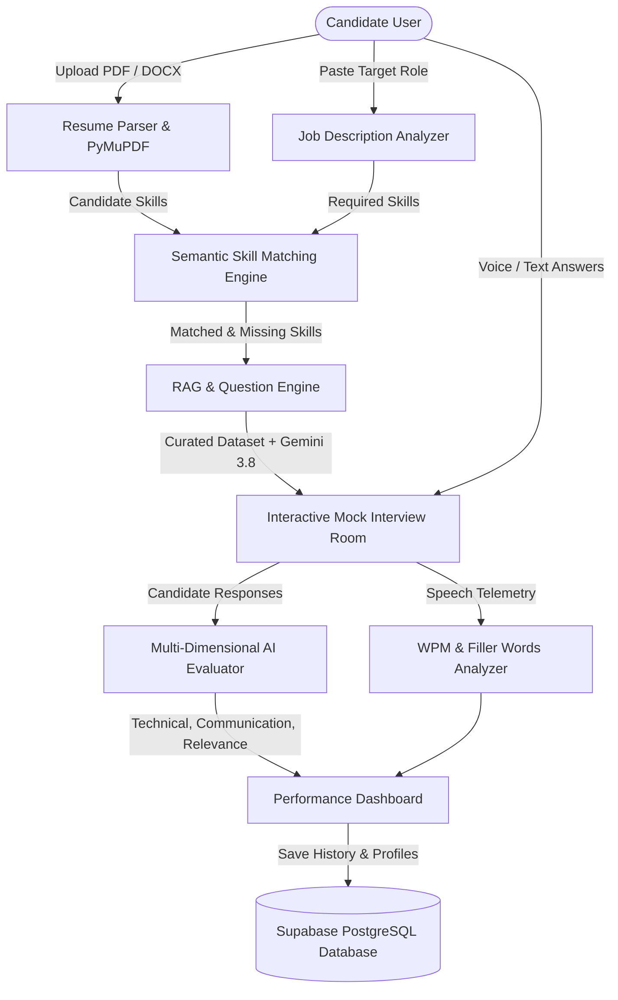

# 🚀 AI Interview Preparation Assistant

[](https://fastapi.tiangolo.com)
[](https://react.dev)
[](https://supabase.com)
[](https://aistudio.google.com)
[](https://tailwindcss.com)
[](LICENSE)

An end-to-end, production-grade AI platform that transforms traditional interview prep into an interactive, data-driven simulation. By integrating **Resume & Job Description Analysis**, **Semantic NLP Skill Gap Calculation**, **RAG Question Generation**, and **Real-Time Speech & Answer Evaluation with Google Gemini 3.8 Flash**, this project bridges the exact gap between candidate credentials and hiring manager expectations.

---

## 📌 Project Architecture



---

## 🌟 Key Features

1. **Intelligent Resume Parser (PyMuPDF & python-docx)**
   - Extracts candidate contact info, education, project details, and maps keywords against a standardized multi-category tech taxonomy.

2. **Job Description Analyzer**
   - Automatically detects required technologies, soft skills, seniority level, and core responsibilities from pasted job postings.

3. **Semantic Skill Matching & Gap Detection**
   - Calculates **Direct Match Percentage** and **Semantic Similarity Score** using Scikit-Learn TF-IDF vectorization and cosine similarity.
   - Highlights matched skills (✓) and flags missing skill gaps (✗) with custom study recommendations.

4. **RAG Question Generation & Dynamic Follow-Ups**
   - Retrieves curated role-specific questions from a categorized question bank and leverages **Google Gemini 3.8 Flash** to synthesize tailored technical, scenario, and behavioral questions.
   - Generates incisive, context-aware follow-up challenges based on the candidate's exact responses.

5. **Voice Interview Room & Speech Telemetry**
   - In-browser voice dictation via Web Speech API with real-time waveform animation.
   - Tracks speech duration, estimated Words Per Minute (WPM), speaking pace (Optimal, Fast, Slow), and filler words count (`um`, `uh`, `like`, `basically`).

6. **Staff-Engineer Grade Multi-Axis Evaluation**
   - Rigorously scores responses across 4 dimensions (0–100):
     - **Technical Accuracy** (35%)
     - **Relevance & Precision** (25%)
     - **Completeness & Edge Cases** (25%)
     - **Communication Clarity** (15%)
   - Surfaces bulleted strengths, improvement opportunities, and reveals comprehensive model answers.

7. **Continuous Performance Dashboard & Radar Matrix**
   - Recharts-powered 5-axis Competency Radar Chart and historical score trajectory line chart.
   - Automated weak skill detection that generates a personalized checklist of topics to practice.

---

## 🛠️ Tech Stack & Why It Was Chosen

| Layer | Technology | Rationale & Advantage |
| :--- | :--- | :--- |
| **Frontend** | React 18 + Vite | Fast HMR, component-driven UI, lightweight bundle size. |
| **Styling** | Tailwind CSS | Modern dark-mode aesthetic with glassmorphism panels. |
| **Charts** | Recharts | SVG-rendered, responsive Radar, Line, and Bar charts. |
| **Backend** | Python + FastAPI | High-throughput async ASGI server with native typing & auto OpenAPI docs. |
| **Database** | **Supabase (PostgreSQL)** | Relational data integrity, Row Level Security (RLS), instant REST/SQL access. |
| **LLM Engine** | **Google Gemini 3.8 Flash** | Fast inference, 1M token context, superior technical evaluation capabilities. |
| **NLP & Vectors** | Scikit-Learn + N-Gram Matching | Accurate TF-IDF cosine similarity and skill boundary detection without heavy bloat. |
| **Voice / Audio**| Web Speech API | Zero-latency, browser-native speech-to-text with telemetry calculation. |
| **Document I/O** | PyMuPDF (`fitz`) + `python-docx` | Robust extraction across PDF, DOCX, and text resume formats. |

---

## 🗄️ Supabase PostgreSQL Database Schema

The database utilizes Supabase's managed PostgreSQL. The SQL definition is included in [`supabase_schema.sql`](./supabase_schema.sql):

- `profiles` — User profile, target role, experience, and credentials.
- `resumes` — Uploaded resume metadata, parsed text, and extracted skills JSONB.
- `job_descriptions` — Target roles, required skills, and responsibilities JSONB.
- `skill_matches` — Match percentage, semantic similarity score, and skill gaps.
- `interview_sessions` — Session lifecycle, difficulty, aggregate scores, and summary feedback.
- `interview_questions` — Questions generated per session with category and keywords.
- `interview_answers` — Candidate responses, speaking metrics, multi-axis grades, and follow-up challenges.

---

## 🚀 Quick Start (Local Development)

### Prerequisites
- Python 3.10+
- Node.js 18+ and npm
- (Optional) Supabase Project & Gemini API Key (The app features a built-in mock fallback for offline evaluation!)

### 1. Clone & Set Up Backend

```bash
# Navigate to backend
cd backend

# Create and activate virtual environment
python -m venv .venv

# Windows PowerShell:
.\.venv\Scripts\Activate.ps1
# macOS/Linux:
source .venv/bin/activate

# Install dependencies
pip install -r requirements.txt

# Configure environment variables (optional for live Supabase/Gemini)
copy .env.example .env

# Run FastAPI server
uvicorn app.main:app --reload --port 8000
```
API Documentation will be live at: `http://localhost:8000/docs`

### 2. Set Up Frontend

```bash
# In a new terminal, navigate to frontend
cd frontend

# Install npm packages
npm install

# Run Vite development server
npm run dev
```
Open `http://localhost:5173` in your browser!

---

## 🧪 Testing

Run backend automated test suite:
```bash
cd backend
pytest tests/
```

---

## 🎓 College Viva & Interview Defense Guide

### Q1: Why did you choose Supabase instead of MongoDB?
> **Answer**: Supabase provides managed PostgreSQL with ACID transactions, native JSONB support, and Row Level Security (RLS). While MongoDB is document-based, an interview platform requires structured relationships (Users → Sessions → Questions → Multi-Metric Answers) where relational integrity, foreign key cascades, and complex joins are critical for reliable dashboard analytics.

### Q2: How does Semantic Skill Matching differ from exact keyword matching?
> **Answer**: Exact keyword matching fails when resumes say *"RESTful API development"* while the JD specifies *"REST API"*, or *"PostgreSQL"* vs *"Postgres"*. We combine n-gram taxonomy matching with TF-IDF Vectorization and Cosine Similarity, measuring the directional cosine angle between the feature vectors.

### Q3: What is RAG and how is it used in your Question Engine?
> **Answer**: Retrieval-Augmented Generation (RAG) grounds the LLM with relevant domain knowledge before generating an answer. Instead of asking Gemini to randomly generate questions, our retriever scans a curated question bank based on the candidate's target role and missing skills, passing these as context to Gemini 3.8 Flash to synthesize targeted questions.

### Q4: How is candidate speech evaluated without heavy server models?
> **Answer**: We leverage the browser's Web Speech API for zero-latency speech recognition and stream audio duration and transcript to FastAPI. The backend computes telemetry metrics: Words Per Minute (WPM), pace categorization (Optimal, Fast, Slow), and regex-based filler words detection (`um`, `uh`, `like`, `basically`).

---

## 📄 License
This project is open-source under the MIT License.
